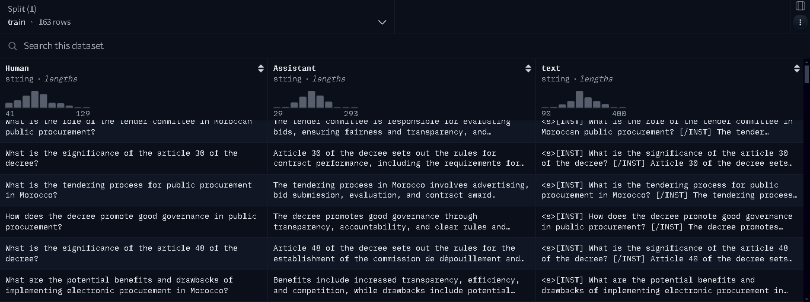
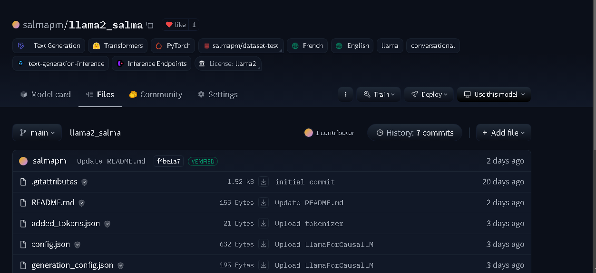

# assistant_llama2
# Développement d'un Assistant IA Génératif Basé sur Llama2 dans le Domaine de la Finance Publique

## Introduction

Llama2 est un modèle de langage avancé développé pour comprendre et générer du texte de manière cohérente et contextuelle. Conçu pour des applications variées, Llama2 offre des performances exceptionnelles dans la génération de réponses pertinentes et naturelles, ce qui en fait un choix idéal pour le développement d'assistants IA dans des domaines spécialisés comme la finance publique.

## Étapes du Projet

### 1. Collecte de Données

- **Conversion des décrets de marché public (2013 et 2023) de fichiers PDF en fichiers .txt** :
   - Utilisez des outils ou bibliothèques comme `PyMuPDF`, `pdfminer.six`, ou `PyPDF2` pour extraire le texte des fichiers PDF et les enregistrer en tant que fichiers .txt.

- **Upload des fichiers à ChatGPT-4** :
   - Chargez les fichiers .txt en utilisant l'API de OpenAI et interrogez le modèle en se basant sur ces documents.

- **Rassemblement d'un dataset sous forme de paires "###human: \"\" ###assistant:\"\":"** :
   - Organisez les données extraites en paires de questions-réponses, en utilisant les balises "###human:" et "###assistant:" pour chaque entrée.

### 2. Préparation du Dataset

Une fois les données collectées, elles doivent être nettoyées et formatées correctement. Cela inclut la suppression des données redondantes, la normalisation des textes, et la structuration des informations sous forme de paires questions-réponses.

- **Utilisation d'une transformation de ce format en utilisant des balises spécifiques** :
   - Adaptez le format des données en utilisant des balises spécifiques pour structurer les questions et les réponses de manière cohérente.
     ### . Déploiement dans Hugging Face

Les données préparées sont ensuite chargées dans Hugging Face, une plateforme qui facilite la gestion et le partage de modèles de machine learning. Nous utilisons les outils de Hugging Face pour organiser et annoter notre dataset.

### 4. Fine-Tuning

Le modèle Llama2 est pré-entraîné sur un large corpus de données générales. Pour l'adapter à notre domaine spécifique, nous effectuons un fine-tuning en utilisant notre dataset de finance publique. Cela permet au modèle d'apprendre les spécificités du langage et des concepts financiers.

### 5. Déploiement du Modèle dans Hugging Face

Enfin, le modèle finement ajusté est déployé sur Hugging Face, rendant notre assistant IA accessible pour des tests et une utilisation pratique. Hugging Face offre une interface API conviviale permettant d'intégrer facilement l'assistant dans des applications ou des services web.

---

Ce fichier README fournit une vue d'ensemble claire du projet et guide les utilisateurs à travers chaque étape du développement de l'assistant IA génératif. Vous pouvez personnaliser les sections selon vos besoins spécifiques et ajouter des liens ou des références supplémentaires si nécessaire.
